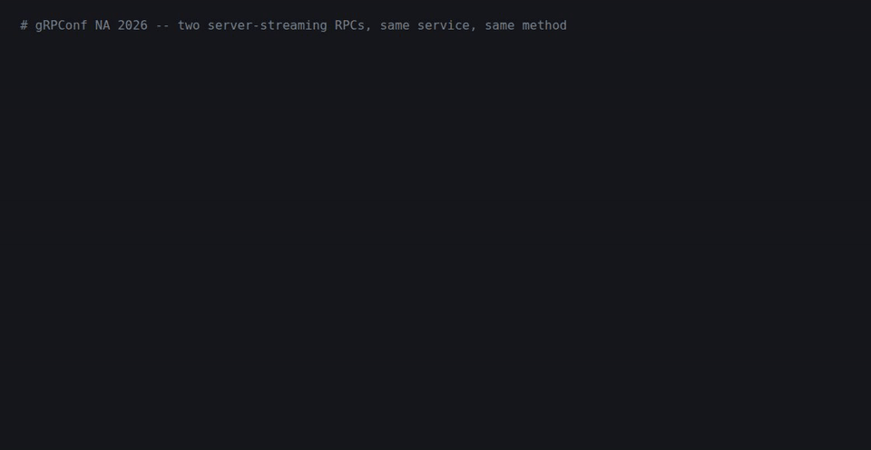

# The demo

Two requests with the same duration and nothing else in common. The recording is
1:50 long.



[Download or play the full-quality video (demo.mp4, 0.9 MB)](demo.mp4)

## What is in here

| file | what it is |
|---|---|
| `demo.mp4` | the recording shown at the talk. Screen capture of the offline player. |
| `demo.gif` | the same recording as an animated preview, for this page |
| `demo_final_frame.png` | the last frame of the recording. The backup slide if the video will not play. |
| `demo_player.html` + `demo.cast` | an offline terminal player and an asciicast v2 recording. Zero network requests. An earlier take, so its figures differ slightly from the video, which is the point of the next section. |
| `rig.py` | the cost model: a real gRPC streaming server over loopback, deadline-paced |
| `build_demo.py` | rebuilds all of the above from real RPCs |
| `inference.proto` and the `_pb2` files | the service definition |

## The figures move. The claim does not.

The rig is a real gRPC server-streaming call over loopback with a simulated
inference cost model: prefill costs 0.4 ms per prompt token, decode costs 1.62 ms
per output token, and tokens leave in messages of 8. It is deadline-paced, meaning
each message is released at an absolute target time. A naive per-message sleep
accumulates the host's timing overshoot 78 times on the long stream and throws the
numbers off by tens of milliseconds.

The two locked workloads:

| | prompt tokens | output tokens | messages |
|---|---|---|---|
| prefill-heavy | 2,000 | 136 | 17 |
| decode-heavy | 50 | 624 | 78 |

Across 330 measured takes on five runs and four machines, the two workloads always
landed within a few percent of each other on `call.duration`, and always more than
an order of magnitude apart on time to first message. The exact ratio is unstable
from run to run (floors and ceilings between 13x and 24x have been observed),
because the decode-heavy first message takes only tens of milliseconds and any
small overhead lands on it. That is why the talk says "more than an order of
magnitude" and never quotes one number.

## Rebuild it

```bash
pip install grpcio
python3 build_demo.py     # needs ffmpeg and a Chromium for the frame render
```

Everything here is loopback, single host, CPython. The apparatus is real. The GPU
is not.
